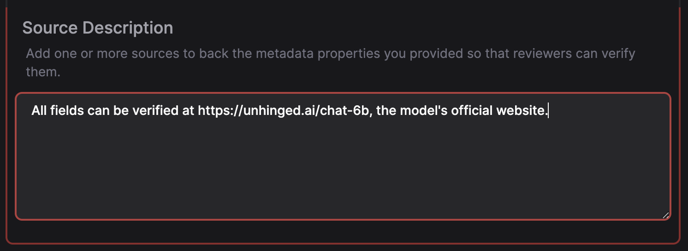

# Contributor Guide

This guide covers voting on pending LLMs and submitting new LLMs to the platform.
If you're looking to contribute to the codebase, see [README.md](../README.md).

---

All LLMs uploaded to the platform are subject to a voting process by contributors.
This ensures that all comparable LLMs have accurate information and prevents spam/abuse.

## Voting

Navigate to the [LLMs](https://ai-to.ai/llms) page. Here you can view and search through all pending, approved, and rejected LLMs uploaded to the platform.

Click on one of the LLMs to expand it. Here you can view the details of the LLM and vote on it.

To cast your vote, navigate to the **Add a Vote** tab. When rejecting an LLM, a reason/comment is required.

## Submitting LLMs

Go to the [Submission](https://ai-to.ai/submit) page. Start filling out the form by adding the LLM's name and metadata. If possible, use existing metadata fields to ensure consistency across LLMs.

**Tip**: You can use abbreviated values for numeric fields (e.g 1M, 2.8K, 25%, etc.). See [Numeric Values](#numericvalues).

Some metadata fields such as benchmarks have an additional note attached to them (e.g. 0-shot). A note can be applied by clicking the icon when focusing the field name input. See [Metadata Best Practices](#metadatabestpractices).

Finally, provide one or more sources to back the LLM's metadata. This can be a research paper or the LLM's official website/documentation.

### Metadata Best Practices

#### Benchmarks

So that benchmark values are consistent across LLMs, the following best practices are recommended:

##### Naming

- When creating a new benchmark field, suffix it with `_benchmark` (e.g. `humaneval_benchmark`)
- If no spaces appear in the original field name, avoid adding underscores. `HumanEval` becomes `humaneval_benchmark`, not `human_eval_benchmark`. Since `Infographic VQA` includes a space, it becomes `infographic_vqa_benchmark`

##### Value

Values **must** be numeric and expressed as a percentage (e.g. `0.85`, `85%`). If a benchmark value is not a percentage/decimal value, the associated LLM should be rejected immediately

##### Notes

- If a benchmark has a note attached to it (e.g. 0-shot), you must apply the note to the metadata field
- Notes should **not** be used to describe a metadata field

#### Recommended Fields

The following fields are recommended for all uploaded LLMs. Optional for LLMs that don't have a value for the field (e.g. Image/Video generation models)

- `use_case`: The intended use case of the LLM (e.g. code generation, summarization, etc.)
- `context_tokens`: The number of context tokens the LLM can process
- `completion_tokens`: The number of tokens the LLM can generate

### Numeric Values

Abbreviated values are supported for numeric fields. The following examples shows valid and invalid values:

| Abbreviation | Value         | Valid |
| ------------ | ------------- | ----- |
| 1M           | 1000000       | ✅    |
| 2.8K         | 2800          | ✅    |
| 25%          | 0.25          | ✅    |
| 3.25B        | 3250000000    | ✅    |
| 2T           | 2000000000000 | ✅    |
| 100          | 100           | ✅    |
| 0.15         | 0.15          | ✅    |
| 25.75%       | 0.2575        | ✅    |
| 1 million    | N/A           | ❌    |
| 4.M          | N/A           | ❌    |
| 9MBT         | N/A           | ❌    |
| K            | N/A           | ❌    |

If you input an invalid numeric value, you will see a warning notice.

## Guidelines & Rules

- **Profanity / Abuse**: LLMs containing profanity or abusive content will be removed from the platform by an administrator. Depending on the severity, the contributor may be banned from the platform.
- **Duplicate LLMs**: LLMs that are duplicates of others will be rejected by contributors.
- **Spam**: Repeatedly uploading LLMs or abusing the voting system will result in your contributor status being revoked.

Use Common Sense. Our admins aren't bots and will take necessary action if you try to bend the rules.
