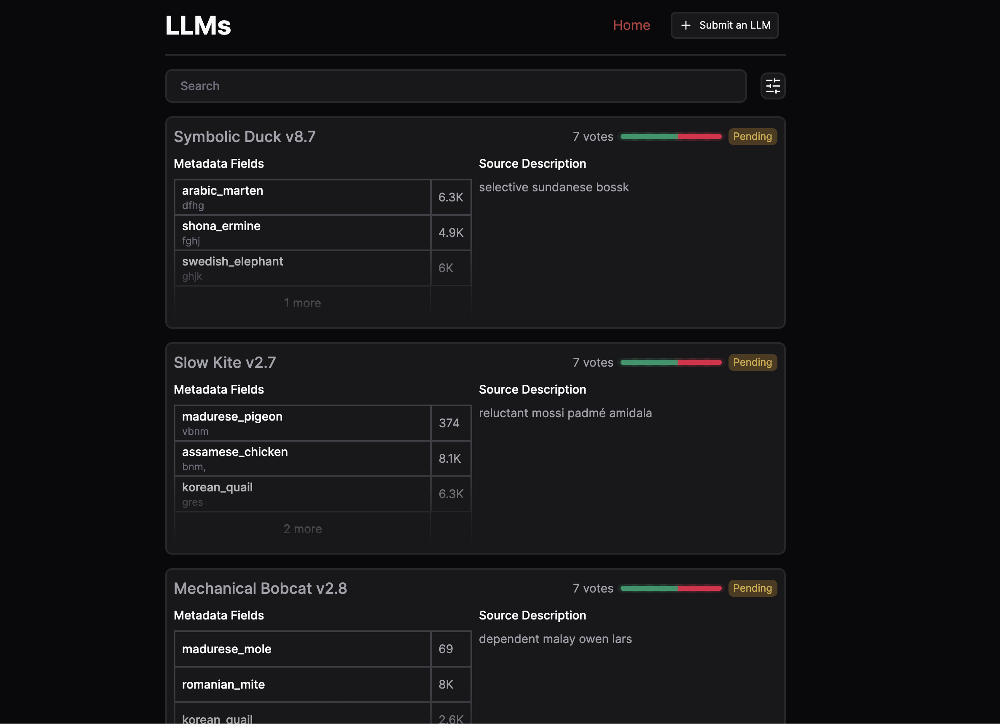
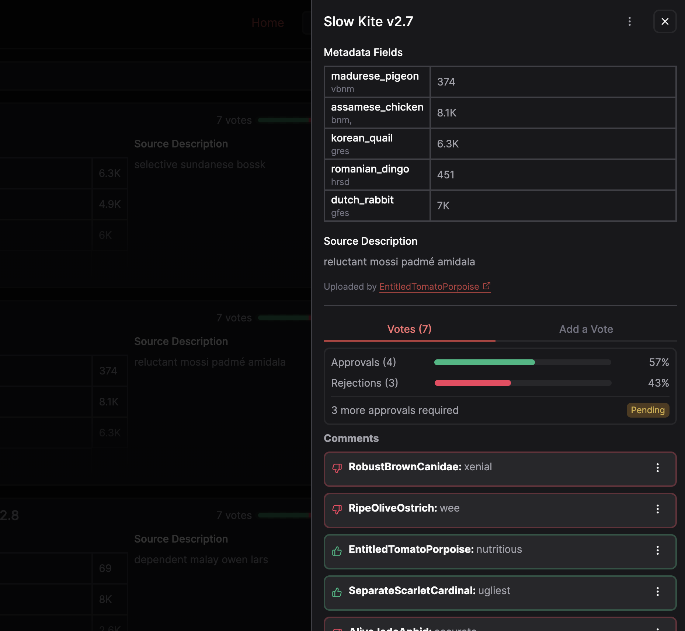
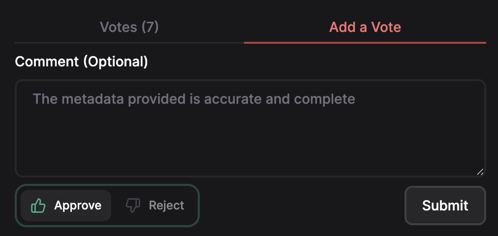
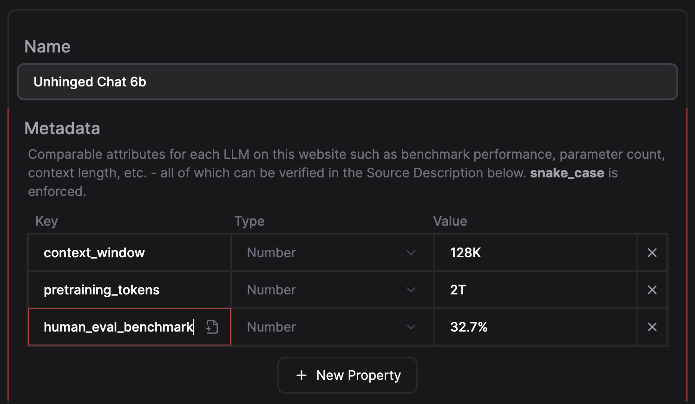
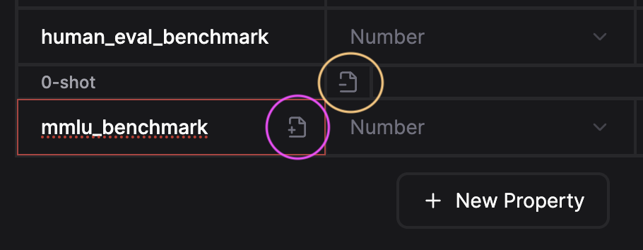
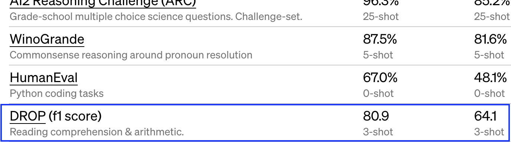
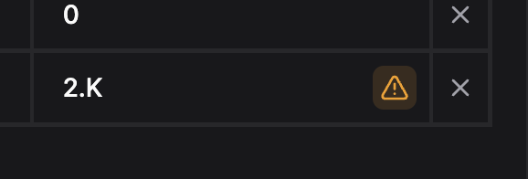

# Contributor Guide

This guide covers [Voting on pending LLMs](#voting) and [Submitting new LLMs](#submittingllms) to the platform.
If you're looking to contribute to the github repository, see [README.md](../README.md).

To begin voting and uploading LLMs, you will need to [apply as a contributor](https://llmarena.ai/contribute).
Once your request has been approved, you will be ready to start contributing to the platform.

## Voting

To prevent spam and abuse and ensure that all uploaded LLMs have accurate information, each LLM is subject to a voting process by contributors.
All pending, approved, and rejected LLMs can be accessed from the [LLMs page](https://llmarena.ai/llms).

Click on one of the items to expand it. From here you will be able to see all the details including Metadata, Sources, and existing votes.

Verify that the information provided is accurate, up-to-date, and follows the contributor guide.
When you're ready to cast your vote, navigate to the **Add a Vote** tab, select a status, add a comment, and then submit it.

<h3>How it works: Deep dive</h3>

After reaching a certain amount of approvals/rejections, an LLM will be automatically approved/rejected based on a modified version of the [Byzantine Fault](https://en.wikipedia.org/wiki/Byzantine_fault) algorithm.

To find the maximum amount of **faulty nodes** (f) with the Byzantine fault algorithm, we use the following formula:

$$
f = \frac{n - 1}{3}
$$

- **n**, the total number of nodes is the **total number of votes** cast on an LLM.
- **f**, the number of faulty nodes is the number of votes that are **not** in line with the majority.

If the number of votes in line with the majority (`n - f`) is greater than the maximum number of opposing votes (`f`), the LLM is approved or rejected automatically.
Otherwise, the LLM will remain in the pending state until it reaches the required number of votes.

The minimum amount of votes required before an LLM can be approved or rejected is 4. This is to prevent an LLM from being approved or rejected by a single vote.

## Submitting LLMs

As mentioned before, this is how LLMs get added to the platform. To submit an LLM, you will need to provide the LLM's name, metadata, and one or more sources to back and ensure the metadata is accurate.

To get started, navigate to the [Submission](https://llmarena.ai/submit) page. Start filling out the form by adding the LLM's name and metadata. If possible, use existing metadata fields to ensure consistency across LLMs.

**Tip**: You can use abbreviated values for numeric fields (e.g 1M, 2.8K, 25%, etc.). See [Numeric Values](#numericvalues).

Some metadata fields such as benchmarks have an additional note attached to them (e.g. `0-shot`). Click the **Add note** icon (circled in pink) when focusing the metadata key/name input. If you've unintentionally added a note, click the **Remove note** icon (circled in yellow).

Finally, provide one or more sources to back the LLM's metadata. This can be a research paper or the LLM's official website/documentation.

**Perquisite**: Please download and watch the [Video Guide](https://github.com/IroncladDev/llm-arena/blob/main/docs/video-guide.mp4) on adding an LLM before you start. The file is too large to display in this file.

## Best Practices

### Recommended Fields

The following fields are recommended for all uploaded LLMs, if applicable:

- `use_case`: The intended use case of the LLM (e.g. code generation, summarization, etc.)
- `context_window_tokens`: The number of context tokens the LLM can process
- `model_size_parameters`: The number of parameters in the LLM
- `pretraining_tokens`: The number of parameters in the LLM

### Benchmarks

So that benchmark values are consistent across LLMs, the following best practices are recommended:

- Suffix benchmark fields with `_benchmark` (e.g. `humaneval_benchmark`)
- If there are no spaces in the benchmark name, avoid adding underscores. For example, `HumanEval` becomes `humaneval_benchmark`, not `human_eval_benchmark`. Since `Infographic VQA` includes a space, it becomes `infographic_vqa_benchmark`
- Benchmark values **must** be numeric and expressed as a percentage value (e.g. `0.85`, `85%`). If a benchmark value is not a percentage/decimal value, the associated LLM should be rejected immediately
- If a benchmark displayed on an AI website/paper has additional context attached to it (e.g. `0-shot`), you must add a note to the metadata field with the additional context
- Notes should not be used to describe what a benchmark does

### Benchmark Scores

In some cases, you will see a benchmark **score** that is not a percentage value. The best practices for these are as follows:

- Suffix **benchmark scores** with `_score` (e.g. `drop_f1_score`)
- Don't convert the score to a percentage value. Just type in the whole number
- Attach a note if additional context is included

### Duplicate Fields

Occasionally, a single benchmark is evaluated multiple times with slightly different conditions. You **can** add multiple benchmark fields with the same key, but the note attached must be different.

Example: An LLM is evaluated on `HumanEval` with a different programming language each time, the same key `humaneval_benchmark` is used multiple times, but each with a different note.

| Key                 | Note       | Type   | Value |
| ------------------- | ---------- | ------ | ----- |
| humaneval_benchmark | Python     | Number | 76.5% |
| humaneval_benchmark | JavaScript | Number | 74.7% |
| humaneval_benchmark | Rust       | Number | 62%   |

## Numeric Values

Abbreviated values are supported for numeric fields. The following examples shows valid and invalid values:

| Abbreviation | Value         | Valid |
| ------------ | ------------- | ----- |
| 1M           | 1000000       | ✅    |
| 2.8K         | 2800          | ✅    |
| 25%          | 0.25          | ✅    |
| 3.25B        | 3250000000    | ✅    |
| 2T           | 2000000000000 | ✅    |
| 100          | 100           | ✅    |
| 0.15         | 0.15          | ✅    |
| 25.75%       | 0.2575        | ✅    |
| 1 million    | N/A           | ❌    |
| 4.M          | N/A           | ❌    |
| 9MBT         | N/A           | ❌    |
| K            | N/A           | ❌    |

If you input an invalid numeric value, you will see a warning indicator by the input:

## Guidelines & Rules

- **Profanity / Abuse**: LLMs containing profanity or abusive content will be removed from the platform by an administrator. Depending on the severity, the contributor may be banned from the platform.
- **Duplicate LLMs**: LLMs that are duplicates of others will be rejected by contributors.
- **Spam**: Repeatedly uploading LLMs or abusing the voting system will result in your contributor status being revoked.

Use Common Sense. Our admins aren't bots and will take necessary action if you try to bend the rules.
